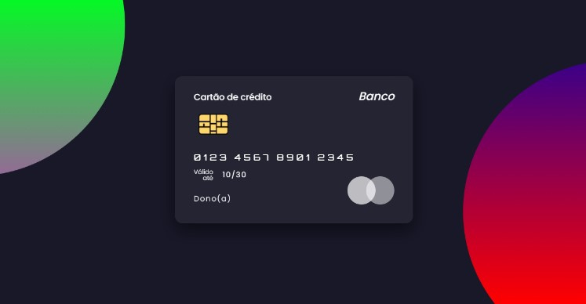

<!---->

# Web Credit Card UI - Glassmorphic UX/UI Design

Esse projeto foi feito por: <strong>Thiago Silva Lopes</strong>, em 06/2021, 
tendo como base o <a href="https://www.youtube.com/watch?v=XeX1vsaufF0">tutorial,</a> do canal do Youtube: 
<a href=https://www.youtube.com/channel/UCbwXnUipZsLfUckBPsC7Jog>Online Tutorials</a>

## Demo: https://glassmorphic-credit-card-ui.netlify.app/
